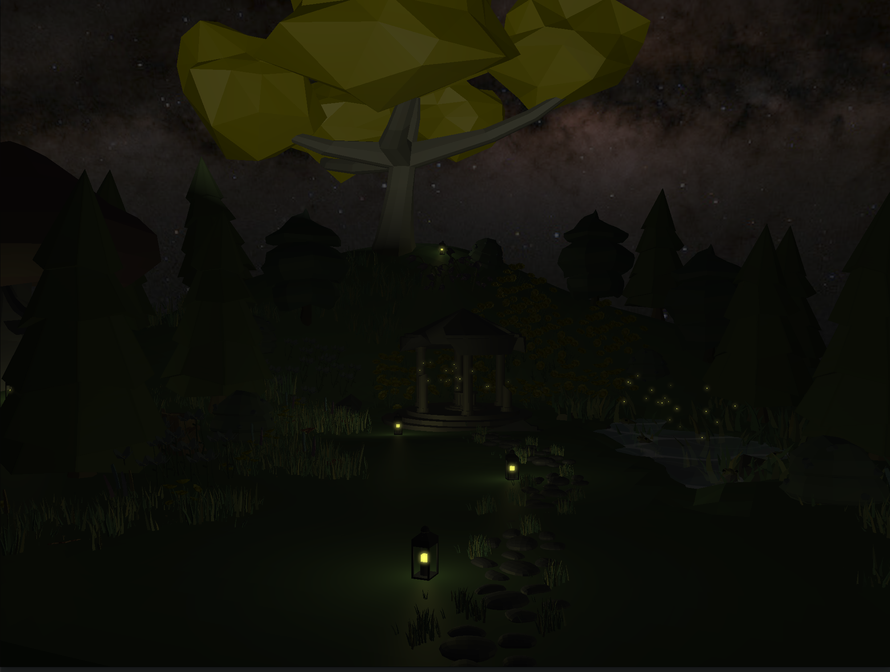

# ThingsBetwixt
[README in english](README.md).  
Projekat za predmet Računarska grafika na Matematičkom fakultetu Univerziteta u Beogradu.

## Odakle sam pozajmio kod
Kod u `main.cpp` i u fajlovima iz `include` direktorijuma (osim `stb_image.h`) sam pisao sam, uz pomoć iz [JoeyDeVrie](https://github.com/JoeyDeVries/LearnOpenGL)-ovog repozitorijuma.
Osim toga, sve ostalo je pozajmljeno iz istog repozitorijuma, uključujući strukturu repozitorijuma, `CMake` fajl, `.gitignore` itd.

## Tasteri
- Kretanje: **W A S D** za napred, levo, nazad, desno; **Space** za gore, **Shift** za dole
- **Escape** za gašenje
- **F** za paljenje ili gašenje lampe
- **- i =** za smanjivanje ili povećavanje brzine kretanja
- **\[ i \]** za smanjivanje ili povećavanje osetljivosti miša
- **X** za invertovanje x ose, **Y** za invertovanje y ose
- **C** za paljenje ili gašenje face culling
- **B** za paljenje ili gašenje blending tj. transparentosti
- **P** za menjanje izmedju BlinnPhong i Phong modela osvetljenja
- **I** za paljenje ili gašenje bloom i HDR
- **Q i E** za smanjivanje ili povećavanje ekspozicije

## Screenshot
[Demo video](https://youtu.be/peo56Z8w0GY). Postaviti kvalitet videa na 1080p.

## Gde sam pronašao modele
[Link ka model fajlovima](https://drive.google.com/drive/folders/1BLc8cdFd9BXdgl4e1esrviWqRjOcZmzQ?usp=sharing). Extract u `resources/objects/`; putanja treba da bude `resources/objects/ThingsBetwixt`.

Većina modela je sa [ovog sajta](https://poly.pizza/) i [ovog sajta](https://sketchfab.com/feed).  
Cveće:
- (https://poly.pizza/m/dYQFgjU5Eqx)
- (https://poly.pizza/m/eLVv17bTyB-)
- (https://poly.pizza/m/1baaAXcdzZ)
- (https://poly.pizza/m/fg5U0dl1Sd3)

Drveće:
- (https://sketchfab.com/3d-models/low-poly-tree-pack-ea6e844754da494a9c38501b4fff92ad)
- (https://sketchfab.com/3d-models/low-poly-tree-concept-e815f8acd6d34528a82feef38d5af880)
- (https://sketchfab.com/3d-models/tree-stump-14c5d090d54d47cd831c43244f82e242)

Ostalo:
- [Shrine](https://sketchfab.com/3d-models/shrine-61c478f77ea14759b61dd8938e4015a6)
- [Lampe](https://poly.pizza/m/37EufrdA2UB)
- [Kameni put](https://poly.pizza/m/0vAJVcMEFdv)
- [Žabe](https://poly.pizza/m/cwyNyIba6WE)
- [Trava](https://poly.pizza/m/eFUpFgjCf0p)
- [Žbun](https://poly.pizza/m/TSbIxkDtxF)

## Progres
| Funkcionalnost                  | Status | Progres | Komentar                                                        |
|---------------------------------|--------|---------|-----------------------------------------------------------------|
| Shader kompilacija i linkovanje | Radi   | Gotovo  | -                                                               |
| Camera kretanje                 | Radi   | Gotovo  | -                                                               |
| Camera gledanje                 | Radi   | Gotovo  | -                                                               |
| Model učitavanje                | Radi   | Gotovo  | -                                                               |
| Point osvetljenje               | Radi   | Gotovo  | -                                                               |
| Directional osvetljenje         | Radi   | Gotovo  | -                                                               |
| Spotlight                       | Radi   | Gotovo  | -                                                               |
| Blinn-Phong-ov model            | Radi   | Gotovo  | -                                                               |
| Blending                        | Radi   | Gotovo  | -                                                               |
| Face culling                    | Radi   | Gotovo  | Moze da izgleda lose jer su neki verteksi lose definisani.      |
| Skybox klasa                    | Radi   | Gotovo  | -                                                               |
| Skybox                          | Radi   | Gotovo  | -                                                               |
| HDR                             | Radi   | Gotovo  | -                                                               |
| Bloom                           | Radi   | Gotovo  | -                                                               |
| SimpleShapes klasa              | Radi   | Gotovo  | -                                                               |

## Preostali posao
- [x] dovrsi ovaj README (03.06.2024.)
- [x] main i osnovne funkcionalnosti (12.04.2024.)
- [x] nacrtaj pravougaonik (12.04.2024.)
- [x] nacrtaj kocku (12.04.2024.)
- [x] kretanje (14.04.2024.)
- [x] shader klasa, preostala neka postavljanja uniformnih (14.04.2024.)
- [x] camera klasa (14.04.2024.)
- [x] rukovanje greskama (16.04.2024.)
- [x] info logovi (16.04.2024.)
- [x] neke akcije na tastaturi (poput gasenja) (14.04.2024.)
- [x] razne callback funkcije (16.04.2024.)
- [x] directional osvetljenje (15.04.2024.)
- [x] point osvetljenje (15.04.2024.)
- [x] problem smera svetlosti kod spotlight-a (16.04.2024.)
- [x] paljenje i gasenje spotlight-a (16.04.2024.)
- [x] jos akcija na tastaturi (+/- brzina, osetljivost, inverzija x/y pogleda...) (16.04.2024.)
- [x] face culling (17.04.2024.)
- [x] blending (17.4.2024.)
- [x] blinn-phong (17.04.2024.)
- [x] paljenje/gasenje efekata (face culling, blending, blinn-phong) (17.04.2024.)
- [x] bloom (30.04.2024.)
  - [x] framebuffers (29.04.2024.)
  - [x] hdr (29.04.2024.)
- [x] skybox (30.05.2024.)
- [x] ucitavanje modela (03.06.2024.)
- [x] SimpleShapes klasa (03.06.2024.)
- [x] voda (03.06.2024.)
- [x] svici (03.06.2024.)
